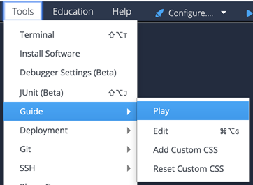

# Debugger Demo
This project demonstrates how to use the Codio debugger, which provides in-browser visual debugging support for the following languages:

- Python
- C
- C++
- NodeJS
- Java

## Start the Guide to see the project
To start Guides from this page, go to the tool bar at the top:

